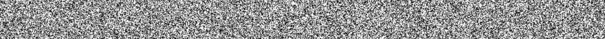

# 

# Noizu
Noizu is a GCC/Clang warnings formatter which lets you exclude specific paths or filenames to suppress their warnings from stderr compiler output. This can be handy for filtering warnings in code bases wich rely a lot on implementation defined behavior (e.g. DSP or SIMD libraries) or simply to separate own warnings from external ones.

## Usage
The first step is to generate a stderr log file. This is usually done by redirecting the standard error stream (default file descriptor 2) during compilation to a file. Please make sure your code is built with the compiler flag *-fmessage-length=0* to avoid line-wrapping.
```sh
make 2> log
```

One we got the log file all that's left is passing it to noizu.py
```sh
python noizu.py log
```

Optionally we could add a path to some source we'd like to exclude
```sh
python noizu.py log -e /EXTERNAL_LIB/
```

And maybe we'd rather like to write the output to a file
```sh
python noizu.py log -e /EXTERNAL_LIB/ -o output_log
```

## Example
The [test folder](test) contains two logs I've prepared in advance, one for [GCC](test/gcc_log) and one for [Clang](test/clang_log). Both logs are from an embedded C/C++ project which contains ARMs [CMSIS](https://developer.arm.com/embedded/cmsis) and STMicroelectronics [HAL](https://www.st.com/en/embedded-software/stm32cube-mcu-packages.html?querycriteria=productId=LN1897) libraries.

Additionally I've added the following source file to the otherwise empty project which will create a couple of warnings.

```c
#include <cstdint>
#include <cstdio>
#include <arm_math.h>

void actual_warnings(int unused) {  // -Wunused -Wunused-parameter

  uint8_t b = 0;  // -Wunused

  long int i = 42;
  unsigned int ui = i;
  if (i == ui)  // -Wsign-compare
    asm volatile("nop");

  unsigned long l;
  l = 0;
  *((unsigned short*)&l) = 1;
  printf("%lu\n", l);  // -Wstrict-aliasing

  {
    int unused = 100;  // -Wshadow
    printf("%d\n", unused);
  }
}
```

Compiling the project with *-Wall*, *-Wconversion*, *-Wextra*, *-Wpedantic* and *-Wshadow* and running it through Noizu shows us an astonishing number of warnings.
```sh
-Wsign-conversion                                                 2403
-Wconversion                                                      324
-Wpedantic                                                        16
-Wunused                                                          7
-Wunused-parameter                                                6
-Wsign-compare                                                    4
-Wstrict-aliasing                                                 3
-Wattributes                                                      2
-Wshadow                                                          1
-Wunused-variable                                                 1

2700+ lines of references...
```

Although in this case we can rather easily spot some of the warnings (e.g. there is just one *-Wshadow*) I'd rather not go through the whole 13k lines of log to find it. Now let's add *CMSIS* and *HAL* to Noizus exclude list.
```sh
python noizu.py test/gcc_log -e CMSIS HAL
```

With all the noise from external libraries gone the new log fits in a couple of lines and makes the warnings easy to spot.
```sh
-Wunused                                                          2
-Wunused-parameter                                                1
-Wsign-compare                                                    1
-Wstrict-aliasing                                                 1
-Wshadow                                                          1
-Wunused-variable                                                 1

-Wunused
src/actual_warnings.cpp:7:11
src/actual_warnings.cpp:5:26

-Wunused-parameter
src/actual_warnings.cpp:5:26

-Wsign-compare
src/actual_warnings.cpp:11:9

-Wstrict-aliasing
src/actual_warnings.cpp:16:5

-Wshadow
src/actual_warnings.cpp:20:9

-Wunused-variable
src/actual_warnings.cpp:7:11
```